# E-commerce React

<p>This is a E-commerce site developed with ReactJS to emulate the purchase of different products gotten from an API REST. It has private and public routes to have access to certain functionalities of the application. </p>

<p>This project is completely responsive and consume different endpoints to filter, list, create a user, login to the user account, among many other functionalities.</p>

<p>The main part of this application is that it has a shopping cart where the user can increment, decrement, eliminate and update the chosen item to finally, get the products and store his/her purchases.</p>
<br />

<h2>Dependencies and installations</h2>
<br />

<ul>
<li>@reduxjs/toolkit v1.8.5</li>
<li>axios v0.27.2</li>
<li>bootstrap v.5.2.2</li>
<li>react v18.2.0</li>
<li>react-bootstrap v2.5.0</li>
<li>react-redux v8.0.4</li>
<li>react-router-dom v6.4.1</li>
</ul>
<br />

<p>If you download the application, you need to install the above dependecies, so, please execute: </p>

```
npm install
```

<p>The tool VITE was used to create this React application, so, to run the project and watch its main functionality, execute: </p>

```
npm run preview
```

<p>If you wish to apply some changes on the code, just make those changes and execute: </p>

```
npm run dev
```

You can check its functionality on live: 

``` 
https://ecommercereactsrsn.netlify.app/
``` 
<br />

<h2>Tools and Technologies</h2>
<br />

<ul>
<li>JavaScript</li>
<li>React Js</li>
<li>CSS3</li>
<li>Boostrap</li>
<li>React Bootstrap</li>
<li>Axios</li>
<li>Redux</li>
<li>Vite</li>
<li>Git / GitHub </li>
</ul>
<br />

<h2>User Interface</h2>
<br />

This project was designed for cellphones, tablets and laptops, so you can check it out from your favorite device.
<br />
<br />

<h3>Phone size</h3>
<br>
<div style="display: grid; grid-template-columns: repeat(2, 1fr); gap: 2rem;">
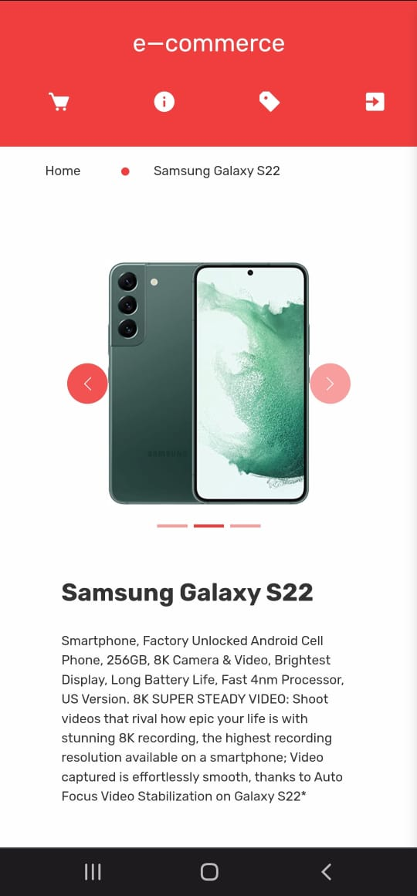
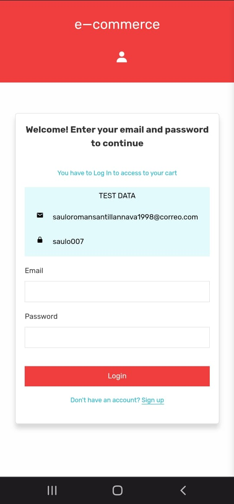
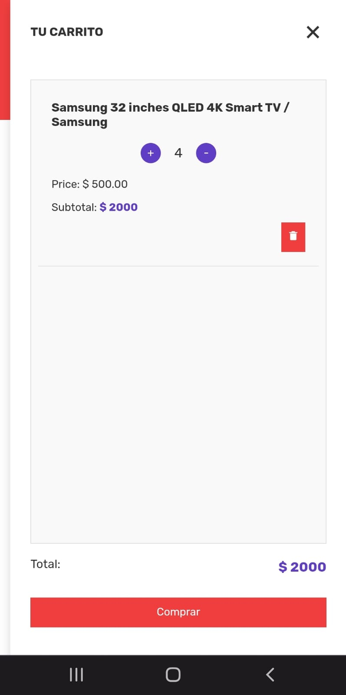
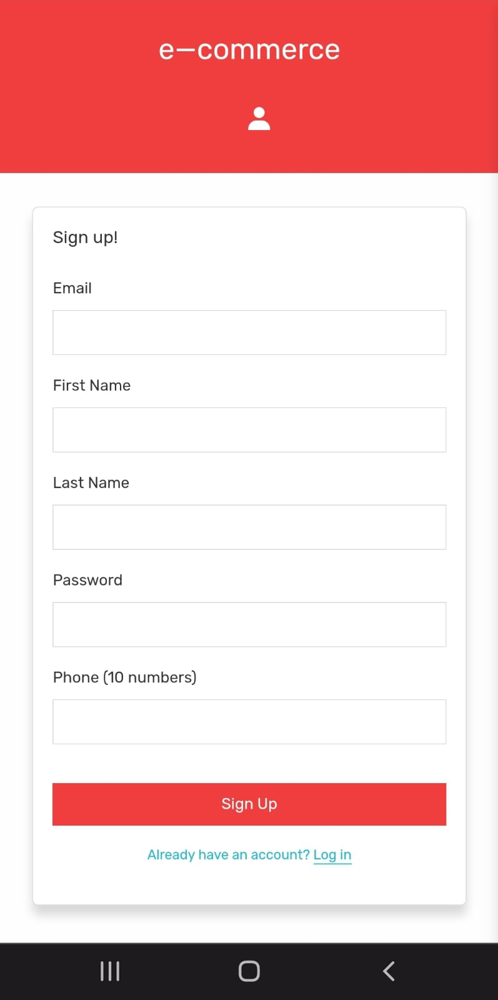
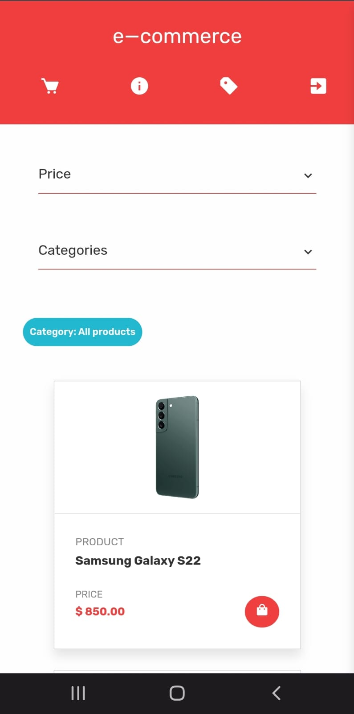
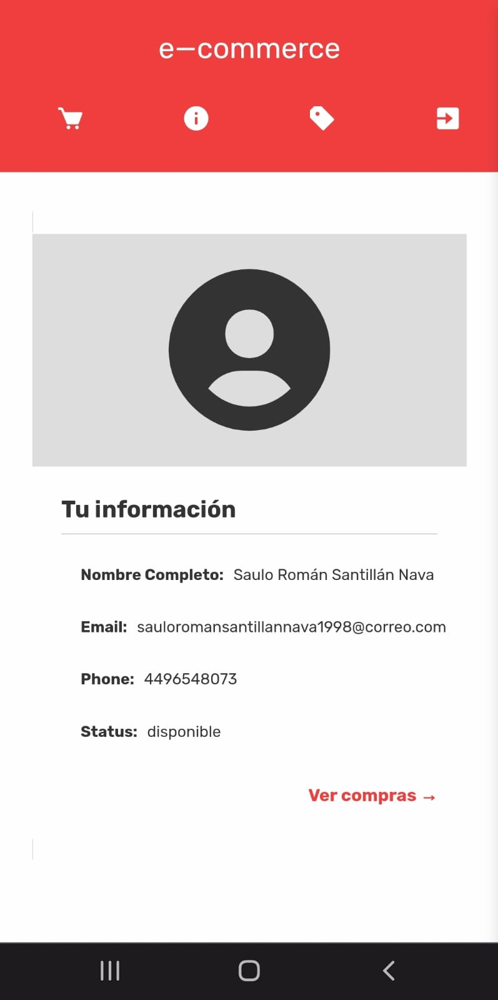
</div>
<br>
<br>

<h3>Desktop size</h3>
<br>
<div style="display: grid; grid-template-columns: repeat(2, 1fr); gap: 2rem;">
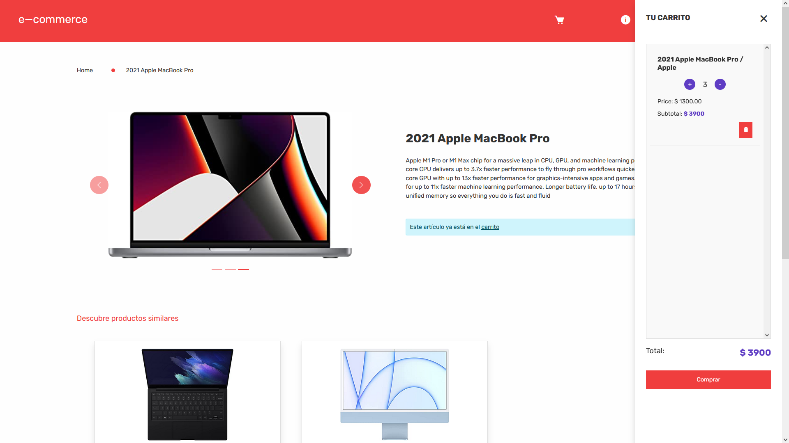
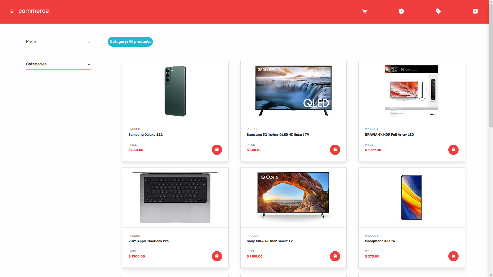
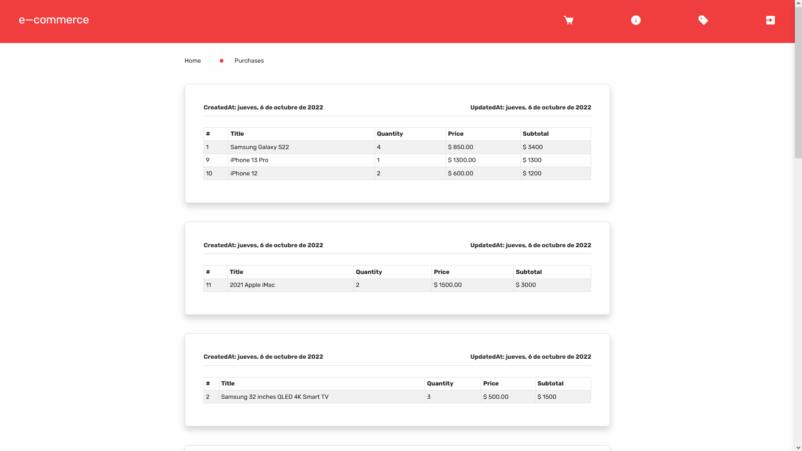
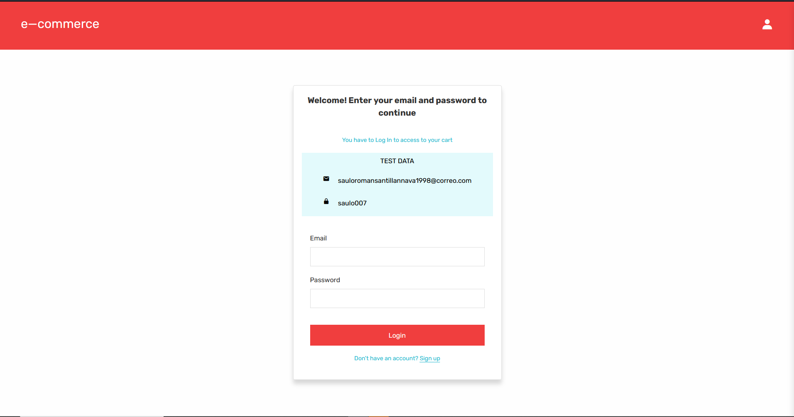
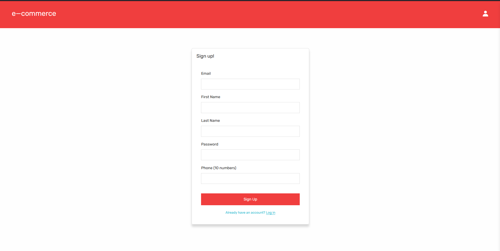
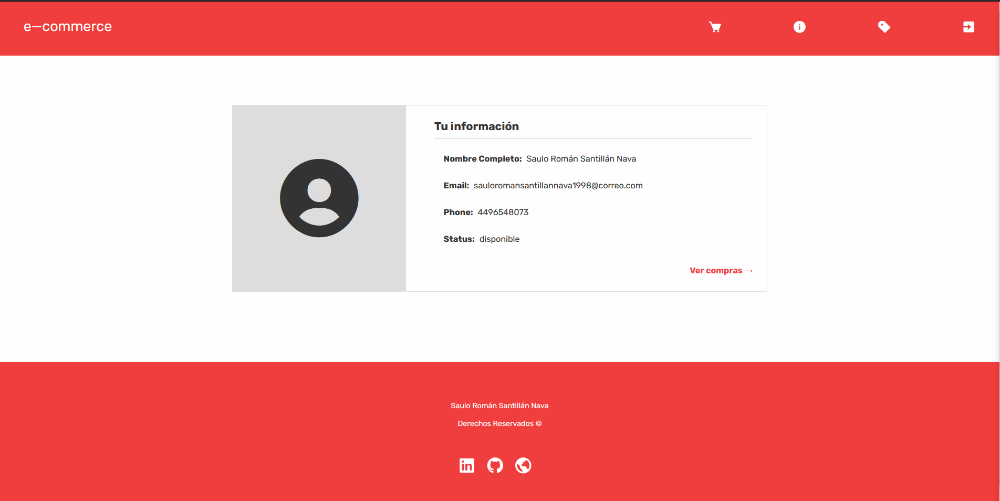
</div>
<br>